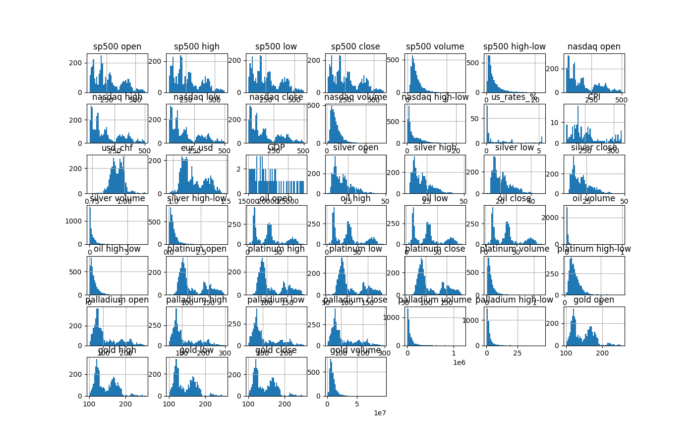

Weston
ACAD 191, Fall 2025
westongu@usc.edu
Homework 5

# Regression Dataset Report

## Code Result

RangeIndex: 3904 entries, 0 to 3903

Data columns (total 47 columns):
 #   Column              Non-Null Count  Dtype  
---  ------              --------------  -----  
 0   date                3904 non-null   object 
 1   sp500 open          3719 non-null   float64
 2   sp500 high          3719 non-null   float64
 3   sp500 low           3719 non-null   float64
 4   sp500 close         3719 non-null   float64
 5   sp500 volume        3719 non-null   float64
 6   sp500 high-low      3719 non-null   float64
 7   nasdaq open         3719 non-null   float64
 8   nasdaq high         3719 non-null   float64
 9   nasdaq low          3719 non-null   float64
 10  nasdaq close        3719 non-null   float64
 11  nasdaq volume       3719 non-null   float64
 12  nasdaq high-low     3719 non-null   float64
 13  us_rates_%          176 non-null    float64
 14  CPI                 176 non-null    float64
 15  usd_chf             3694 non-null   float64
 16  eur_usd             3694 non-null   float64
 17  GDP                 57 non-null     float64
 18  silver open         3719 non-null   float64
 19  silver high         3719 non-null   float64
 20  silver low          3719 non-null   float64
 21  silver close        3719 non-null   float64
 22  silver volume       3719 non-null   float64
 23  silver high-low     3719 non-null   float64
 24  oil open            3719 non-null   float64
 25  oil high            3719 non-null   float64
 26  oil low             3719 non-null   float64
 27  oil close           3719 non-null   float64
 28  oil volume          3719 non-null   float64
 29  oil high-low        3719 non-null   float64
 30  platinum open       3719 non-null   float64
 31  platinum high       3719 non-null   float64
 32  platinum low        3719 non-null   float64
 33  platinum close      3719 non-null   float64
 34  platinum volume     3719 non-null   float64
 35  platinum high-low   3719 non-null   float64
 36  palladium open      3719 non-null   float64
 37  palladium high      3719 non-null   float64
 38  palladium low       3719 non-null   float64
 39  palladium close     3719 non-null   float64
 40  palladium volume    3719 non-null   float64
 41  palladium high-low  3719 non-null   float64
 42  gold open           3719 non-null   float64
 43  gold high           3719 non-null   float64
 44  gold low            3719 non-null   float64
 45  gold close          3719 non-null   float64
 46  gold volume         3719 non-null   float64
dtypes: float64(46), object(1)

memory usage: 1.4+ MB

## Description

This dataset is for gold price regression prediction. The data is a time series dataset with financial info for some market indices, commodities, economic indicators, and forex rates. Market indices and commodities are represented via the respective exchange-traded fund. It includes values from 2010 to 2024. All the attributes are numeric and we can use the data set to predict gold open/high/low/close/volume based on regression
