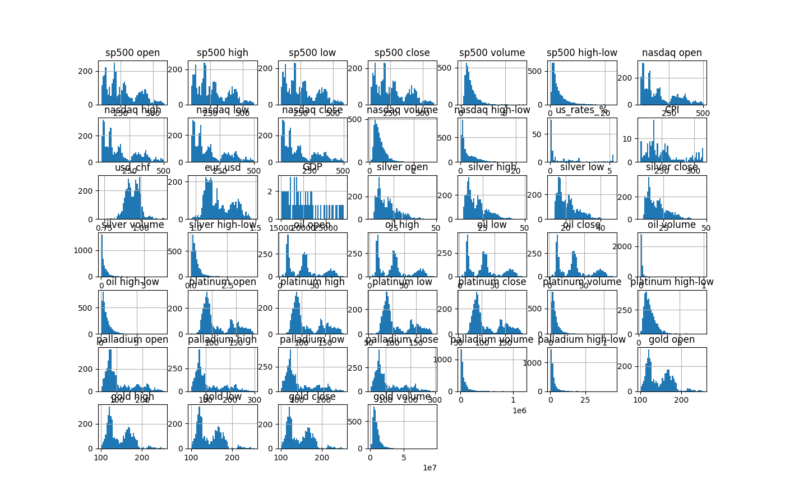
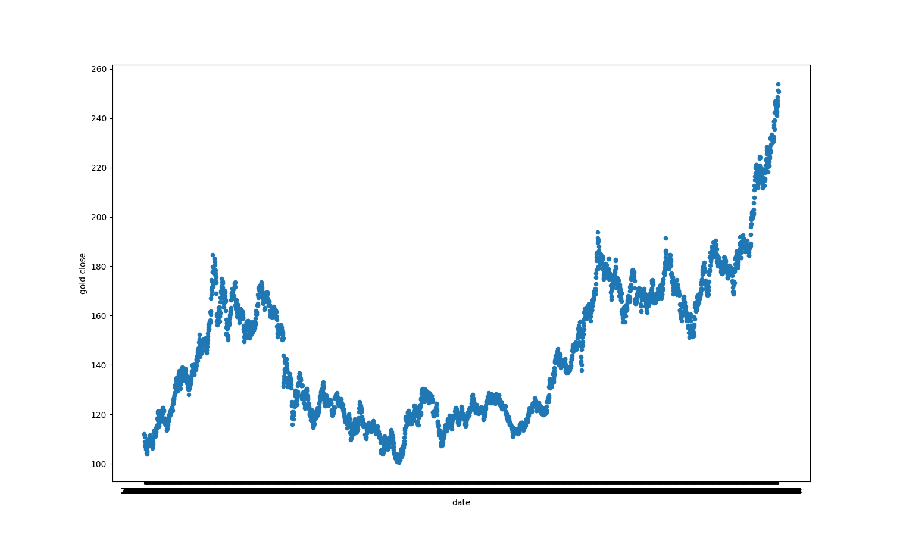

Weston
ACAD 191, Fall 2025
westongu@usc.edu
Homework 5

# Regression Dataset Report

## Code Result

RangeIndex: 3904 entries, 0 to 3903

Data columns (total 47 columns):
 #   Column              Non-Null Count  Dtype  
---  ------              --------------  -----  
 0   date                3904 non-null   object 
 1   sp500 open          3719 non-null   float64
 2   sp500 high          3719 non-null   float64
 3   sp500 low           3719 non-null   float64
 4   sp500 close         3719 non-null   float64
 5   sp500 volume        3719 non-null   float64
 6   sp500 high-low      3719 non-null   float64
 7   nasdaq open         3719 non-null   float64
 8   nasdaq high         3719 non-null   float64
 9   nasdaq low          3719 non-null   float64
 10  nasdaq close        3719 non-null   float64
 11  nasdaq volume       3719 non-null   float64
 12  nasdaq high-low     3719 non-null   float64
 13  us_rates_%          176 non-null    float64
 14  CPI                 176 non-null    float64
 15  usd_chf             3694 non-null   float64
 16  eur_usd             3694 non-null   float64
 17  GDP                 57 non-null     float64
 18  silver open         3719 non-null   float64
 19  silver high         3719 non-null   float64
 20  silver low          3719 non-null   float64
 21  silver close        3719 non-null   float64
 22  silver volume       3719 non-null   float64
 23  silver high-low     3719 non-null   float64
 24  oil open            3719 non-null   float64
 25  oil high            3719 non-null   float64
 26  oil low             3719 non-null   float64
 27  oil close           3719 non-null   float64
 28  oil volume          3719 non-null   float64
 29  oil high-low        3719 non-null   float64
 30  platinum open       3719 non-null   float64
 31  platinum high       3719 non-null   float64
 32  platinum low        3719 non-null   float64
 33  platinum close      3719 non-null   float64
 34  platinum volume     3719 non-null   float64
 35  platinum high-low   3719 non-null   float64
 36  palladium open      3719 non-null   float64
 37  palladium high      3719 non-null   float64
 38  palladium low       3719 non-null   float64
 39  palladium close     3719 non-null   float64
 40  palladium volume    3719 non-null   float64
 41  palladium high-low  3719 non-null   float64
 42  gold open           3719 non-null   float64
 43  gold high           3719 non-null   float64
 44  gold low            3719 non-null   float64
 45  gold close          3719 non-null   float64
 46  gold volume         3719 non-null   float64
dtypes: float64(46), object(1)

memory usage: 1.4+ MB

## Description

This dataset is for gold price regression prediction. The data is a time series dataset with financial info for some market indices, commodities, economic indicators, and forex rates. Market indices and commodities are represented via the respective exchange-traded fund. It includes values from 2010 to 2024. All the attributes are numeric and we can use the data set to predict gold open/high/low/close/volume based on regression

## Week 9 Update

I separated the dataset into train set and test set, train set contain 80 percent of the row and the test set contain 20 percent of the rows. Before that, I have also drop the row that the data is missing.

## Scatter Plot
Here is the Scatter Plot of the date and the gold open price

## Linear Regression and Correlation

Because that the dataset that I used contain not only one target variable, but five, which are "Gold Open", "Gold Close", "Gold High", "Gold Low", and "Gold Volume", so I run four different correlation

### Correlation Result

Here is the correlation between gold open and the other variables:
sp500 open            0.695577
sp500 high            0.696114
sp500 low             0.695199
sp500 close           0.695345
sp500 volume         -0.356685
sp500 high-low        0.283649
nasdaq open           0.745527
nasdaq high           0.746172
nasdaq low            0.745641
nasdaq close          0.745937
nasdaq volume        -0.132443
nasdaq high-low       0.560044
us_rates_%            0.245538
CPI                   0.726144
usd_chf              -0.539413
eur_usd              -0.362248
GDP                   0.680769
silver open           0.531338
silver high           0.532819
silver low            0.525713
silver close          0.529241
silver volume         0.795491
silver high-low       0.440593
oil open              0.614452
oil high              0.616241
oil low               0.613202
oil close             0.616579
oil volume           -0.205454
oil high-low          0.602415
platinum open        -0.268380
platinum high        -0.271265
platinum low         -0.271424
platinum close       -0.267937
platinum volume       0.157959
platinum high-low    -0.015800
palladium open        0.550381
palladium high        0.547642
palladium low         0.547488
palladium close       0.548827
palladium volume     -0.367852
palladium high-low    0.419252
dtype: float64
--------------------------------
Here is the correlation between gold high and the other variables:
sp500 open            0.695508
sp500 high            0.696233
sp500 low             0.694992
sp500 close           0.695207
sp500 volume         -0.356877
sp500 high-low        0.296878
nasdaq open           0.745014
nasdaq high           0.745705
nasdaq low            0.745036
nasdaq close          0.745356
nasdaq volume        -0.135846
nasdaq high-low       0.568266
us_rates_%            0.241905
CPI                   0.728459
usd_chf              -0.538235
eur_usd              -0.368260
GDP                   0.682279
silver open           0.527064
silver high           0.528827
silver low            0.521693
silver close          0.525370
silver volume         0.793864
silver high-low       0.439673
oil open              0.612384
oil high              0.614151
oil low               0.611126
oil close             0.614484
oil volume           -0.196338
oil high-low          0.600200
platinum open        -0.273463
platinum high        -0.276198
platinum low         -0.276423
platinum close       -0.272907
platinum volume       0.157481
platinum high-low    -0.011815
palladium open        0.554551
palladium high        0.551807
palladium low         0.551538
palladium close       0.552822
palladium volume     -0.367951
palladium high-low    0.426899
dtype: float64
--------------------------------
Here is the correlation between gold low and the other variables:
sp500 open            0.699604
sp500 high            0.700264
sp500 low             0.699214
sp500 close           0.699418
sp500 volume         -0.374571
sp500 high-low        0.290547
nasdaq open           0.748018
nasdaq high           0.748671
nasdaq low            0.748096
nasdaq close          0.748413
nasdaq volume        -0.151249
nasdaq high-low       0.564532
us_rates_%            0.238945
CPI                   0.730088
usd_chf              -0.549117
eur_usd              -0.363377
GDP                   0.684652
silver open           0.531526
silver high           0.533408
silver low            0.526775
silver close          0.530462
silver volume         0.789234
silver high-low       0.426941
oil open              0.613358
oil high              0.615225
oil low               0.612235
oil close             0.615686
oil volume           -0.202618
oil high-low          0.599534
platinum open        -0.272707
platinum high        -0.275296
platinum low         -0.275370
platinum close       -0.271851
platinum volume       0.143983
platinum high-low    -0.021920
palladium open        0.558625
palladium high        0.555956
palladium low         0.555792
palladium close       0.557108
palladium volume     -0.390164
palladium high-low    0.425905
dtype: float64
--------------------------------
Here is the correlation between gold close and the other variables:
sp500 open            0.699579
sp500 high            0.700380
sp500 low             0.699153
sp500 close           0.699367
sp500 volume         -0.376244
sp500 high-low        0.297768
nasdaq open           0.747930
nasdaq high           0.748668
nasdaq low            0.748007
nasdaq close          0.748333
nasdaq volume        -0.156370
nasdaq high-low       0.569867
us_rates_%            0.240556
CPI                   0.731995
usd_chf              -0.550530
eur_usd              -0.367657
GDP                   0.686017
silver open           0.527058
silver high           0.529025
silver low            0.522310
silver close          0.526208
silver volume         0.789329
silver high-low       0.427460
oil open              0.610679
oil high              0.612534
oil low               0.609603
oil close             0.613038
oil volume           -0.195314
oil high-low          0.594939
platinum open        -0.277492
platinum high        -0.280023
platinum low         -0.280092
platinum close       -0.276527
platinum volume       0.140158
platinum high-low    -0.022738
palladium open        0.558107
palladium high        0.555436
palladium low         0.555246
palladium close       0.556530
palladium volume     -0.390681
palladium high-low    0.426539
dtype: float64
--------------------------------
Here is the correlation between gold volume and the other variables:
sp500 open           -0.342448
sp500 high           -0.343835
sp500 low            -0.344657
sp500 close          -0.343362
sp500 volume          0.721971
sp500 high-low       -0.088419
nasdaq open          -0.300754
nasdaq high          -0.300465
nasdaq low           -0.301414
nasdaq close         -0.300586
nasdaq volume         0.679438
nasdaq high-low      -0.153286
us_rates_%            0.001448
CPI                  -0.289433
usd_chf               0.392407
eur_usd               0.113369
GDP                  -0.297243
silver open          -0.056490
silver high          -0.058352
silver low           -0.075209
silver close         -0.074419
silver volume        -0.000288
silver high-low       0.470024
oil open             -0.033398
oil high             -0.035915
oil low              -0.036813
oil close            -0.038701
oil volume            0.034877
oil high-low          0.010982
platinum open         0.240420
platinum high         0.233685
platinum low          0.229785
platinum close        0.228493
platinum volume       0.479340
platinum high-low     0.285161
palladium open       -0.324509
palladium high       -0.326546
palladium low        -0.329396
palladium close      -0.328608
palladium volume      0.815378
palladium high-low   -0.133795
dtype: float64
--------------------------------

### Analysis

The price of the Gold have middle to strong correlation with sp500 price, nasdaq price, CPI, GDP, oil price, platinum price and palladium price, and have low to non correlation with high-low of those index and good, volume of those index and good and us tax rate.

While the volume of the Gold have middle to strong correlation with the volumn of sp500, nasdaq index and the volumn of goods like oil, platinum and palladium, also have a middle correlation to the high-low of those index and good, have a non to weak correlation with the price of the goods and index, GDP and CPI. While there is a non-correlation with us tax rate

In conclusion, the factors that have high correlation with price and volume are different, but us tax rate is a factor that can be drop because it's unrelated to both price and volume of the gold.